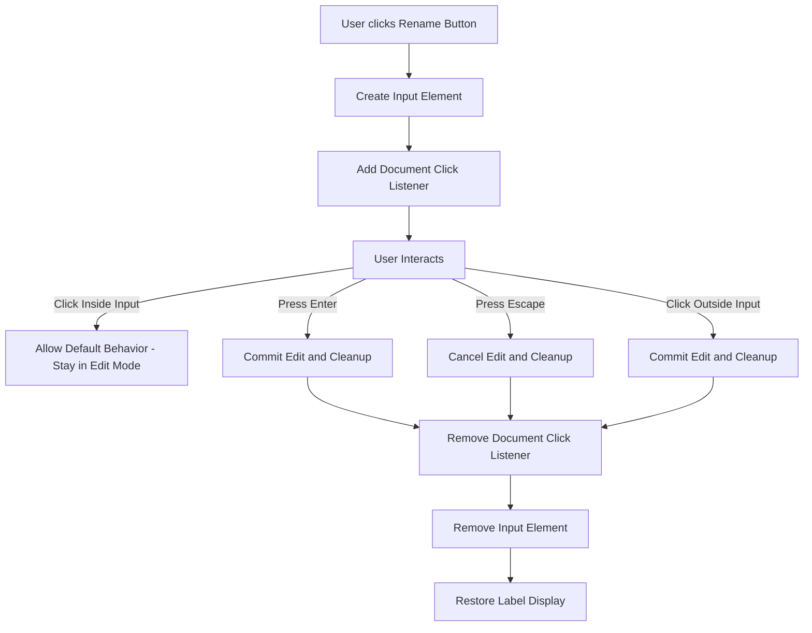

# Chat Rename Component - Click-Outside Event Handling Plan

## Overview

Update the chat renaming component in [`sidebar.js`](ctrlpanel/js/chat/sidebar.js) to replace the current `blur`-based closure mechanism with a click-outside listener. This ensures that clicking inside the text field preserves the editing state and allows full interaction, while clicking outside strictly triggers closure of renaming mode.

## Current Implementation Analysis

### Location
- **File**: [`ctrlpanel/js/chat/sidebar.js`](ctrlpanel/js/chat/sidebar.js:56-109)
- **Function**: `renderChatList()` → rename button click handler

### Current Event Handling (Lines 56-109)

```javascript
// Current problematic implementation
input.addEventListener("blur", commitEdit);  // Line 103
```

**Issues with current approach:**
1. The `blur` event fires whenever the input loses focus
2. This can happen unintentionally (e.g., window switching, certain browser interactions)
3. Does not distinguish between clicking inside vs. outside the input field

## Proposed Solution

### Event Flow Diagram



### Implementation Changes

#### 1. Remove `blur` Event Listener
Remove line 103 which adds the blur listener:
```javascript
// REMOVE THIS
input.addEventListener("blur", commitEdit);
```

#### 2. Add Click-Outside Listener
Add a document-level click listener that checks if the click target is within the input field:

```javascript
// Click-outside handler
const handleClickOutside = (event) => {
    if (!input.contains(event.target)) {
        commitEdit();
    }
};

// Add listener with slight delay to prevent immediate trigger
setTimeout(() => {
    document.addEventListener("click", handleClickOutside);
}, 0);
```

#### 3. Cleanup Event Listener
Modify `commitEdit` and `cancelEdit` functions to remove the document click listener:

```javascript
const commitEdit = () => {
    document.removeEventListener("click", handleClickOutside);
    const newTitle = input.value.trim();
    if (newTitle) {
        renameChat(chat.id, newTitle);
        label.textContent = newTitle;
    }
    input.remove();
    label.style.display = "";
};

const cancelEdit = () => {
    document.removeEventListener("click", handleClickOutside);
    input.remove();
    label.style.display = "";
};
```

### Complete Modified Code Block

Replace lines 56-109 with the following implementation:

```javascript
renameBtn.addEventListener("click", (e) => {
    e.preventDefault();
    e.stopPropagation();

    // Hide the label
    label.style.display = "none";

    // Create inline input
    const input = document.createElement("input");
    input.type = "text";
    input.className = "nav-chat-rename-input";
    input.value = chat.title;
    input.setAttribute("aria-label", "Edit chat title");

    // Prevent chat item click when interacting with input
    input.addEventListener("click", (ie) => {
        ie.preventDefault();
        ie.stopPropagation();
    });

    // Click-outside handler - strictly checks if click is outside input
    const handleClickOutside = (event) => {
        if (!input.contains(event.target)) {
            commitEdit();
        }
    };

    // Handle commit on Enter
    const commitEdit = () => {
        document.removeEventListener("click", handleClickOutside);
        const newTitle = input.value.trim();
        if (newTitle) {
            renameChat(chat.id, newTitle);
            label.textContent = newTitle;
        }
        input.remove();
        label.style.display = "";
    };

    // Handle cancel on Escape
    const cancelEdit = () => {
        document.removeEventListener("click", handleClickOutside);
        input.remove();
        label.style.display = "";
    };

    input.addEventListener("keydown", (ke) => {
        if (ke.key === "Enter") {
            ke.preventDefault();
            commitEdit();
        } else if (ke.key === "Escape") {
            ke.preventDefault();
            cancelEdit();
        }
    });

    // Insert input after label's original position (after icon)
    icon.after(input);
    input.focus();
    input.select();

    // Add click-outside listener with delay to prevent immediate trigger
    setTimeout(() => {
        document.addEventListener("click", handleClickOutside);
    }, 0);
});
```

## Key Implementation Details

### 1. Delay on Click Listener Attachment
```javascript
setTimeout(() => {
    document.addEventListener("click", handleClickOutside);
}, 0);
```
The `setTimeout(..., 0)` ensures the current click event that triggered the rename button completes before attaching the click-outside listener. This prevents the listener from immediately firing due to the same click event.

### 2. `contains()` for Boundary Check
```javascript
if (!input.contains(event.target))
```
Using `input.contains(event.target)` accurately determines if the click occurred within the input element or any of its descendants.

### 3. Cleanup in Both Exit Paths
Both `commitEdit()` and `cancelEdit()` must remove the document click listener to prevent memory leaks and unexpected behavior.

## Testing Checklist

- [ ] Click rename button - input appears and is focused
- [ ] Click inside input field - editing continues (no closure)
- [ ] Click outside input field - editing commits and closes
- [ ] Press Enter - editing commits and closes
- [ ] Press Escape - editing cancels and closes
- [ ] Click another chat item - editing commits and navigates
- [ ] Click rename button of another chat - previous edit commits, new edit starts
- [ ] No memory leaks - event listener properly removed in all exit scenarios

## Files to Modify

| File | Changes |
|------|---------|
| [`ctrlpanel/js/chat/sidebar.js`](ctrlpanel/js/chat/sidebar.js) | Update rename button click handler (lines 56-109) |

## Benefits of This Approach

1. **Precise boundary detection**: Only closes when truly clicking outside
2. **Better UX**: Users can click inside the input freely without losing focus
3. **Explicit cleanup**: Event listeners are properly managed
4. **Maintainable**: Clear separation of concerns between commit and cancel actions
